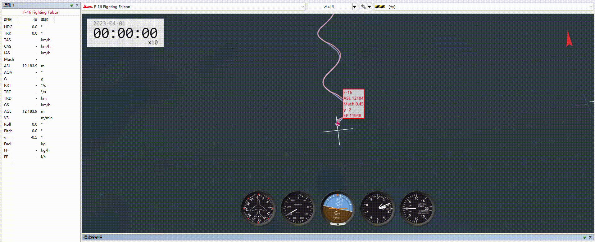
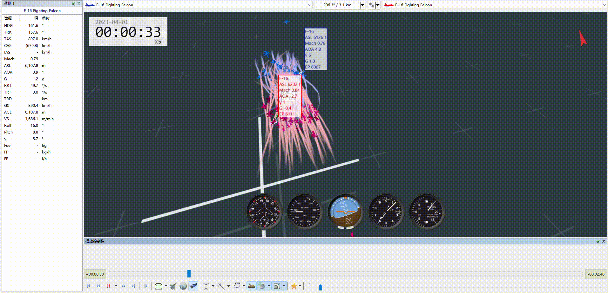

# Planax: A JAX-Accelerated High-Fidelity Fixed-Wing MARL Benchmark

Planax is a GPU-resident benchmark framework for fixed-wing aerial reinforcement learning under nonlinear six-degree-of-freedom (6-DOF) dynamics, tensorized aerodynamic lookup tables, and flight-envelope constraints.

This repository provides the anonymous implementation snapshot for the submitted paper:

> **Planax: A JAX-Accelerated High-Fidelity Reinforcement Learning Benchmark for Large-Scale Fixed-Wing Aerial Swarms**

The repository is anonymized for double-anonymous review. Author information and full citation details will be added after the review process.

---

## Highlights

- **JAX/XLA-compiled fixed-wing dynamics**  
  Nonlinear 6-DOF aircraft dynamics are implemented using JAX-native array operations and compiled with XLA for batched GPU execution.

- **Tensorized aerodynamic lookup tables**  
  Aerodynamic coefficients are evaluated through tensorized lookup-table operations, avoiding additional neural-surrogate approximation error.

- **GPU-resident rollout pipeline**  
  Dynamics propagation, aerodynamic evaluation, observation construction, reward computation, and termination checks are executed in a batched JAX pipeline.

- **Benchmark tasks for fixed-wing aerial RL**  
  The suite includes single-agent agile tracking, S-maneuver tracking, cooperative formation keeping, adversarial pursuit-evasion, and large-scale competitive swarm interaction.

- **PPO-family baseline algorithms**  
  The repository includes training and evaluation scripts for representative PPO, IPPO, MAPPO, and hierarchical policy baselines.

- **Tacview-compatible visualization**  
  Rollouts can be exported for 3-D replay and qualitative analysis.

---

## Repository Structure

```text
.
├── dynamics/              # 6-DOF fixed-wing dynamics and aircraft models
├── interpolate/           # Tensorized aerodynamic lookup and interpolation utilities
├── envs/                  # Gymnax-style benchmark environments
├── baselines/             # PPO-family and hierarchical baseline components
├── assets/                # Figures and GIF demonstrations used in this README
├── results/               # Generated logs, checkpoints, and evaluation outputs
├── train_*.py             # Training entry points
├── render_*.py            # Evaluation and visualization entry points
├── env_min.yml            # Minimal Conda environment for reproducibility
└── README.md
```

---

## Installation

This anonymous repository snapshot is intended for review-time reproducibility.

```bash
# Option 1: download the anonymous repository snapshot from the provided link
# and enter the repository directory
cd AeroPlanax

# Option 2: clone the anonymous repository if supported by the hosting service
git clone https://anonymous.4open.science/r/Aeroplanax-2087/ AeroPlanax
cd AeroPlanax
```

Create the Conda environment:

```bash
conda env create -f env_min.yml
conda activate NeuralPlanex
```

The environment file specifies the main dependencies used in the experiments, including JAX, Flax, Optax, Gymnax-style interfaces, and visualization utilities. CUDA versions can be adjusted as long as a compatible JAX GPU backend is available.

---

## Benchmark Tasks

Planax follows a unified batched interaction interface. Each task returns normalized observations, task-specific rewards, termination flags, and auxiliary information in tensorized form.

The default simulation frequency is:

```text
simulation frequency: 50 Hz
simulation step:      0.02 s
control interval:     10 simulation steps = 0.20 s
```

### 1. Single-Agent Agile Tracking

This task evaluates whether a policy can track commanded flight states under nonlinear fixed-wing dynamics.

- **Agents:** 1
- **Observation:** ego flight state and tracking-related quantities, including attitude features, airspeed, altitude, aerodynamic angles, and body rates
- **Action:** 4-channel discretized actuator command
- **Objective:** reduce tracking error while remaining inside the prescribed flight envelope
- **Termination:** timeout, low altitude, low speed, excessive load factor, extreme aerodynamic angles, or out-of-bound states

Example visual demonstration:


---

### 2. S-Maneuver Tracking

This task evaluates agile single-aircraft maneuvering under the same 6-DOF dynamics and flight-envelope constraints.

- **Agents:** 1
- **Observation:** ego flight state, maneuver reference, and tracking error features
- **Action:** 4-channel discretized actuator command
- **Objective:** follow a high-dynamic reference maneuver while maintaining safe flight
- **Termination:** timeout or flight-envelope violation

Example visual demonstration:



> If the GIF is not shown, please place the file at `assets/s_maneuver.gif`.

---

### 3. Cooperative Formation Keeping

This task evaluates decentralized cooperation among multiple fixed-wing aircraft.

- **Agents:** variable number of aircraft
- **Observation:** ego state and relative neighbor geometry
- **Action:** 3-channel discretized high-level reference command
- **Objective:** maintain a prescribed formation pattern while avoiding collision and flight-envelope violations
- **Termination:** timeout, collision, out-of-bound states, or flight-envelope violation

Supported formation templates include wedge, line, and diamond configurations.

Example visual demonstration:


---

### 4. Adversarial Pursuit-Evasion

This task evaluates competitive multi-agent interaction under identical fixed-wing dynamics.

- **Agents:** team-based setting
- **Observation:** ego state and range-limited relative geometry
- **Action:** 3-channel discretized high-level reference command
- **Objective:** improve relative positioning while maintaining safe flight
- **Termination:** timeout, task success/failure event, collision, out-of-bound states, or flight-envelope violation

Example visual demonstration:


---

### 5. Large-Scale Competitive Swarm Interaction

This task evaluates whether the benchmark can support large-scale decentralized interaction and visualization.

- **Agents:** large team-based setting
- **Observation:** ego state and range-limited relative geometry
- **Action:** 3-channel discretized high-level reference command
- **Objective:** maintain coordinated interaction under fixed-wing dynamics and safety constraints
- **Termination:** timeout, task event, collision, out-of-bound states, or flight-envelope violation

Example visual demonstration:



> If the GIF is not shown, please place the file at `assets/50v50_swarm.gif`.

---

## Running Training Scripts

The repository provides training scripts for representative baseline policies. The exact script names may differ across tasks, but the general workflow is:

```bash
# Single-agent agile tracking
python train_heading_discrete.py

# Cooperative formation / re-formation
python train_reformation.py

# Hierarchical adversarial pursuit-evasion
python train_pursuit_evasion_hierarchy.py
```

If a script name differs in the anonymized snapshot, please refer to the corresponding `train_*.py` file and configuration in the repository.

Common training parameters include:

| Parameter | Meaning |
|---|---|
| `NUM_ENVS` | Number of parallel environments |
| `NUM_ACTORS` | Number of agents per environment |
| `NUM_STEPS` | Rollout steps collected before each policy update |
| `TOTAL_TIMESTEPS` | Total environment interaction steps |
| `LR` | Learning rate |
| `GAMMA` | Discount factor |
| `GAE_LAMBDA` | GAE parameter |
| `CLIP_EPS` | PPO clipping coefficient |
| `MAX_GRAD_NORM` | Gradient clipping norm |
| `OUTPUTDIR` | Output directory for logs and checkpoints |
| `SAVEDIR` | Checkpoint directory |
| `LOADDIR` | Optional directory for loading pretrained weights |

The released configurations use PPO-family algorithms with generalized advantage estimation, recurrent policy networks, gradient clipping, and greedy evaluation for benchmark reporting.

---

## Evaluation and Rendering

Evaluation scripts generate rollout logs and visualization files.

```bash
# Single-agent tracking visualization
python render_heading_discrete.py

# Cooperative formation visualization
python render_reformation.py

# Hierarchical pursuit-evasion visualization
python render_pursuit_evasion_hierarchy.py
```

Generated replay files can be inspected with Tacview-compatible visualization tools. The rendering scripts are intended for qualitative inspection and for generating the GIF demonstrations shown above.

---

## Reproducing Main Results

The paper reports four categories of results:

1. **Simulation throughput and scalability**  
   Batched environment steps per second and GPU memory footprint.

2. **Coefficient-level aerodynamic fidelity**  
   Comparison between tensorized aerodynamic lookup outputs and tabulated aerodynamic coefficients.

3. **Multi-agent benchmark validation**  
   Training curves for cooperative formation keeping and adversarial pursuit-evasion.

4. **Fidelity ablation**  
   Comparison between policies trained with simplified dynamics and policies trained with high-fidelity aerodynamic constraints.

The exact commands and configuration files used for the submitted experiments are included in the repository. Results may vary slightly depending on GPU model, JAX version, CUDA backend, and compiler settings.

---

## Visual Demonstrations

The README includes lightweight GIF demonstrations for quick inspection:

| Demonstration | File |
|---|---|
| Heading / agile tracking | `assets/heading.gif` |
| S-maneuver tracking | `assets/s_maneuver.gif` |
| Cooperative formation | `assets/formation.gif` |
| Adversarial pursuit-evasion | `assets/5v5_hierarchy.gif` |
| Large-scale 50v50 swarm interaction | `assets/50v50_swarm.gif` |

For review-time multimedia material, these demonstrations may also be combined into a short anonymous video.

---

## Anonymity Notice

This repository is an anonymized snapshot prepared for double-anonymous review.

- Author names, affiliations, emails, and institutional identifiers have been removed.
- Citation information will be restored after review.
- The public anonymous link should be used instead of any non-anonymous source repository.
- Please do not infer author identity from file history, local paths, or external repository metadata.

---

## Citation

Citation information will be added after the review process.

---

## License

Planax is released under the MIT License. See `LICENSE` for details.
